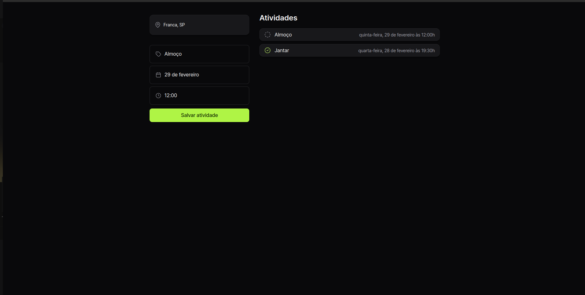
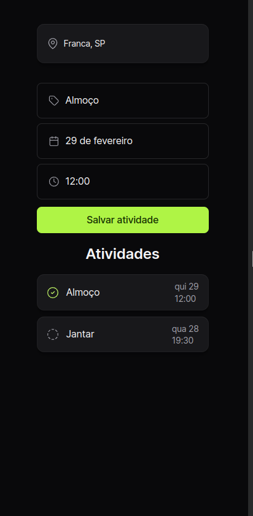

# Planejador de atividades
  Esse projeto é um planejador de atividades e foi realizado por meio do curso HTML+CSS+JavaScript da rocketseat.

## ✒️ Site

* **Veja o [site](https://planejador-de-atividades.netlify.app/)**

## 📸 Preview

  

## 
Link do curso: 
[https://app.rocketseat.com.br/events/nlw-journey/fullstack/abertura](https://app.rocketseat.com.br/events/nlw-journey/fullstack/abertura)

---
